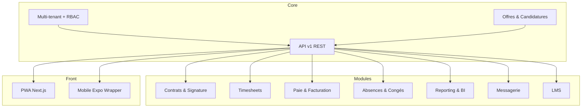

# SaaS Intérim & Staffing – Cahier des Charges (v1.0)

## 1. Contexte & Demande initiale (JCL)

Le client **JCL**, basé au Gabon, souhaite digitaliser la gestion de ses activités d’intérim et de placement de personnel, avec une couverture **multi-pays CEMAC**.  
Leur besoin exprimé dans le cahier des charges initial :

- **Application mobile + Web** pour :  
  - Publier des offres d’intérim,  
  - Permettre aux candidats de postuler,  
  - Gérer les contrats,  
  - Suivre les heures (pointage, déclarations),  
  - Facturer les clients entreprises.  

- **Trois profils d’utilisateurs** :  
  - **Intérimaires** : profil, CV, candidatures, contrats, heures, fiches de paie, notifications.  
  - **Clients entreprises** : demandes de personnel, suivi missions, validation heures, factures.  
  - **Gestionnaires internes** (JCL) : pilotage global, contrats, suivi heures, statistiques.  

- **Objectifs principaux** :  
  - Digitaliser et simplifier les processus,  
  - Optimiser le suivi administratif et opérationnel,  
  - Sécuriser les données (RGPD),  
  - Être **multi-pays, multi-devises (FCFA)**, multilingue.  

---

## 2. Historique de nos échanges (évolution de la réflexion)

- **Phase 1 – WordPress (WP Job Manager)**  
  Avantages : rapide, économique, plugins existants, thèmes pro.  
  Limites : dépendance aux plugins, moins flexible pour la paie/contrats/présence.  
  → Idée : plugin custom “JCL Workforce Suite”.

- **Phase 2 – Hybride**  
  WP en back-office + front sur-mesure.  
  Avantage : UI moderne.  
  Limite : double complexité.

- **Phase 3 – SaaS maison**  
  Construire un **SaaS modulaire, multi-tenant**, type Odoo mais spécialisé intérim.  
  Facturation en abonnement raisonnable (≤ 6 000 €/an).  
  → Solution retenue.

---

## 3. Cahier des Charges détaillé

### 3.1 Core
- Multi-tenant, RBAC.  
- Offres/missions, candidatures.  
- Multi-pays/devises, sous-domaines auto.  
- Dashboard, API v1 (REST).  
- PWA mobile-first.  
- I18n FR/EN/ES/PT.

### 3.2 Modules
1. Contrats & signature.  
2. Timesheets / Heures.  
3. Paie & Facturation.  
4. Absences & Congés.  
5. Portail client avancé.  
6. Mobile natif (phase 2).  
7. Reporting & BI.  
8. Messagerie interne.  
9. LMS léger.  
10. Marque blanche.  
11. Sécurité avancée.

### 3.3 Paramètres par tenant
- Heures sup & majorées.  
- Astreinte, calendrier férié.  
- Durée CDD max.  
- Congés/absences avec justificatifs (upload mobile).  
- Gabarits fiches de paie configurables.  

### 3.4 I18n
- Fichiers JSON i18next.  
- Documents multilingues.

### 3.5 Stockage & Hébergement
- Pas AWS/S3.  
- Stockage local VPS + quotas.  
- Backup quotidien (rsync chiffré).  
- VPS conseillé : 4 vCPU / 8–16 Go RAM / 200 Go SSD.  
- Mutualisé = non recommandé.

### 3.6 Performance
- TTFB < 300 ms.  
- API P95 < 400 ms.  
- LCP < 2,5 s.

### 3.7 Sécurité & Qualité
- OWASP ASVS L2, Argon2/bcrypt.  
- RGPD (export/suppression).  
- CI/CD GitHub Actions.  
- Tests unitaires, intégration, E2E.  
- Docs : README.md, TODO.md, FICHIER-LIAISON.md.

---

## 4. Solution technique proposée

### Front
- Next.js (React) + Tailwind.  
- PWA immédiate.  
- Wrapper mobile via Expo si besoin.

### Back
- FastAPI (Python) + SQLAlchemy + Postgres.  
- Alternative : NestJS + Prisma.

### DB
- PostgreSQL (RLS multi-tenant).  
- Migrations (Alembic/Prisma).  

### Infra
- Déploiement systemd.  
- Nginx reverse proxy.  
- Monitoring Netdata/UptimeRobot.  
- SSL auto (Let’s Encrypt).

---

## 5. Schéma d’Architecture

---

## 6. Justification des choix
- WordPress testé → limité.  
- Hybride → lourd.  
- SaaS maison → pérenne, scalable, revendable.  
- Next.js + FastAPI → moderne, rapide, robuste.  
- PWA d’abord → coût et délai minimaux.  
- Stockage local + backup VPS → coûts contrôlés.

---

## 7. Roadmap MVP (7 semaines)
- S1 : cadrage, i18n, repo, CI/CD.  
- S2–S3 : Core (auth, offres, candidatures, API, PWA).  
- S4 : Contrats & signature.  
- S5 : Timesheets v1.  
- S6 : Règles avancées (HS, astreinte, CDD).  
- S7 : Absences/congés + UAT.

---

## 8. Must-have 2025
- Feature flags par tenant.  
- Journaux d’audit inviolables.  
- No-code règles paie.  
- KPI RH & financiers.  
- Offline timesheets robustes.  
- Exports BI natifs.
